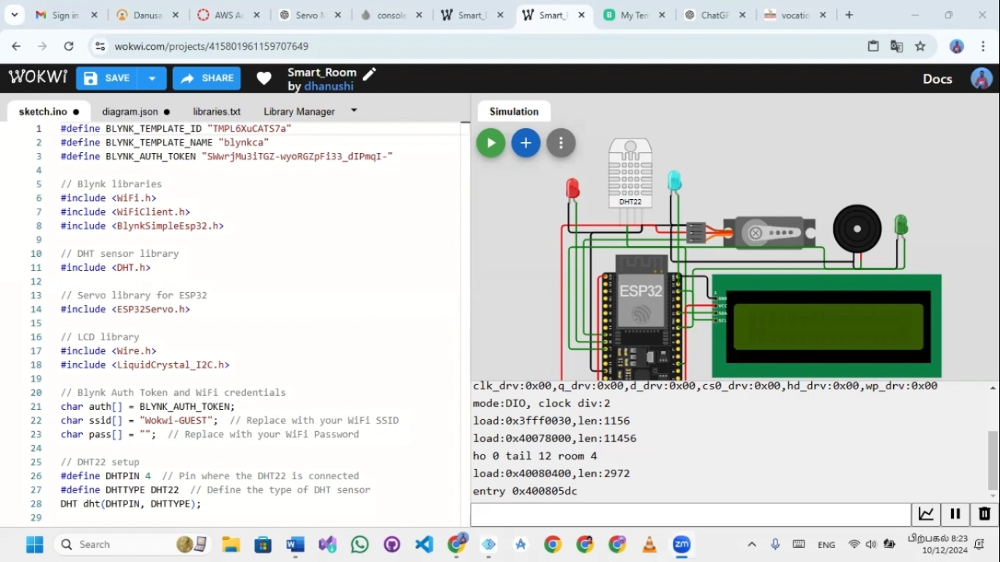
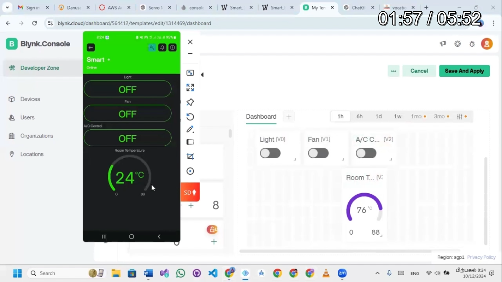
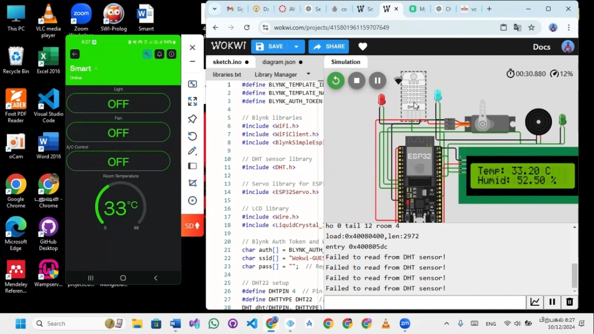

IoT-Powered Smart Room for Optimal Living Comfort
Overview
In an era where technology shapes our daily lives, smart systems are transforming traditional environments into intelligent ones. This project, IoT-Powered Smart Room for Optimal Living Comfort, is an innovative solution that leverages IoT technology to create a responsive and comfortable living space. The system automates essential tasks like temperature control, lighting, and device management while providing real-time monitoring for an enhanced user experience.

Key Components
ESP32 Microcontroller: The brain of the system, connecting sensors, actuators, and the Blynk app.
DHT22 Sensor: Measures temperature and humidity in real-time.
Servo Motor: Automatically adjusts based on temperature thresholds.
Blynk App: Provides a user-friendly interface for remote control and monitoring.
LCD Display: Displays real-time temperature, humidity, and system statuses.
Buzzer and LED: Alerts and visual indications for critical conditions.
How It Works
The system uses an ESP32 microcontroller to connect sensors, actuators, and the Blynk app. The DHT22 sensor monitors temperature and humidity, and based on predefined thresholds, the system triggers actions such as turning on a fan (servo motor) or activating a buzzer. The LCD provides real-time data, and users can control devices remotely via the Blynk app.

Real-Time Monitoring
Real-time monitoring is achieved through the DHT22 sensor and the LCD display. Users can view the temperature and humidity levels on the LCD or the Blynk app interface. This ensures users are always aware of their room's conditions and can make adjustments as needed.

Key Benefits
Convenience: Automates routine tasks, reducing manual effort.
Energy Efficiency: Activates devices only when necessary, conserving energy.
Comfort: Ensures an optimal living environment by maintaining ideal temperature and humidity levels.
Remote Control: Allows users to manage devices from anywhere using the Blynk app.
Possible Applications
Smart Homes: Enhances the comfort and efficiency of residential spaces.
Offices: Maintains a conducive working environment with automated controls.
Greenhouses: Regulates temperature and humidity for optimal plant growth.
Challenges and Solutions
During the development of this project, several challenges were encountered:

Sensor Accuracy: Ensuring precise readings from the DHT22 sensor.
Solution: Regular calibration.

Wi-Fi Stability: Maintaining a reliable connection.
Solution: Implementing reconnect logic in the code.

Power Management: Managing energy consumption of connected devices.
Solution: Optimized hardware usage.

Future Improvements
Voice Control: Integrating voice assistants like Alexa or Google Assistant for hands-free operation.
Enhanced Security: Adding motion sensors and cameras for security features.
Data Logging: Storing historical data for analysis and insights.

## Screenshots

Here are a few screenshots showcasing the IoT Smart Room interface and system status:

### 1. Blynk App Interface

### 2. Real-Time Temperature & Humidity on LCD Display

### 3. System in Action (Fan/Servo Motor Operation)

Installation and Setup
Prerequisites
ESP32 Microcontroller
DHT22 Sensor
Servo Motor
Blynk App Account (Available for iOS and Android)
Arduino IDE with ESP32 Board Setup
Steps
Connect Hardware:

Connect the DHT22 sensor to the ESP32.
Connect the servo motor to the ESP32.
Connect the LCD Display, Buzzer, and LED accordingly.
Install Required Libraries:

Open Arduino IDE and install the necessary libraries:
DHT library for temperature and humidity.
Blynk library for remote control functionality.
Servo library for controlling the servo motor.
Configure Blynk:

Create a new project in the Blynk app and get the authentication token.
Add widgets to control devices (e.g., buttons for the fan, temperature & humidity display).
Upload the Code:

Download and upload the provided code to your ESP32 using the Arduino IDE.
Ensure you replace the Blynk token with your own and configure any other necessary settings.
Start Monitoring:

Once the code is uploaded, open the Blynk app and monitor your smart room remotely.
Conclusion
The IoT-Powered Smart Room for Optimal Living Comfort showcases the potential of IoT in enhancing everyday life. By combining real-time monitoring, automation, and user-friendly interfaces, the project provides a glimpse into the future of smart living. This system is not only a step towards smarter homes but also a foundation for a sustainable and efficient lifestyle.

License
This project is licensed under the MIT License - see the LICENSE file for details.

